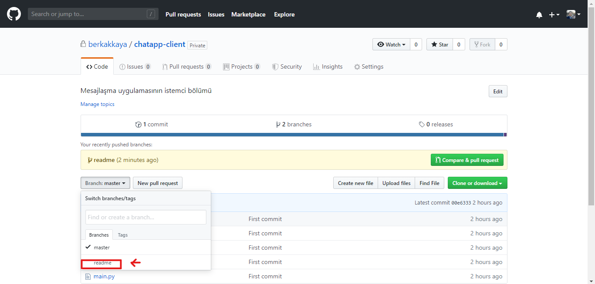

# Şifreli Mesajlaşma Uygulaması (İstemci Bölümü)

## Proje Hakkında

Şifreli Mesajlaşma Uygulaması'nın istemci kısmıdır.
Bu proje Dündar Çiloğlu Programlama Takımı'nın kodları incelemesi ve geliştirilmesi için Github'a yüklenmiştir.

**Not: _Bu projenin kaynak kodlarını bu grup dışında başka bir kişi ile paylaşmak yasaktır._**

_Not: Şifreli Mesajlaşma Uygulaması'nın sunucu kodlarına [buradan ulaşabilirsiniz.](https://www.google.com)_

## Katkıda Bulunma

### 1) Projeyi İndirmek

Not: Projeye katkıda bulunabilmeniz için Git programının sizde yüklü olması gerekir. [Programı buradan yükleyebilirsiniz.](https://git-scm.com/)

Kaynak kodlarını indirmek için şu komutları sırasıyla girin ve bu kodları kendinize göre ayarladıktan sonra ENTER tuşuna basın:

```sh
git init
git clone https://github.com/berkakkaya/chatapp-client.git
git config --global user.name "Adınız Soyadınız" #Kendi adınızı ve soyadınızı tırnak içerisine girin.
git config --global user.email "e-postanız@gmail.com" #Kendi ana e-posta adresinizi tırnak içerisine girin.
```

Artık projeye katkıda bulunmak için hazırsınız.

### 2) Düzenlemeler için bir dal açmak

Git sisteminde düzenli bir çalışma yapabilmeniz ve projede karmaşa olmaması için Git sistemi üzerinden bir dal oluşturmanız ve düzenlemeleri onun üzerinden yapmanız daha iyi olacaktır.

Şimdi şu komutları sırasıyla girin ve bu kodları kendinize göre ayarladıktan sonra ENTER tuşuna basın:

*Not: Kendi dalınızın adını girmeniz gereken yerler `dal-adi` olarak belirtilmiştir. Buralardaki `dal-adi` belirteçlerinin yerine kendi dalınızın adını giriniz.*

```sh
git branch dal-adi
git checkout dal-adi
```

Artık düzenleme yapmak için hazırsınız. Düzenlemelerinizi yaptıktan sonra değişiklikleri dala eklemek için şu komutları girin (düzenleme yaptığınız dalda):

```sh
git add .
git commit -m "Yeni renk değiştirme komutları eklendi." #Yaptığınız düzenlemeleri tırnak içerisinde kısa bir şekilde anlatın.
git push github #Eğer hata alırsanız git push origin komutunu deneyin.
```

Artık yaptığınız değişiklikler Github üzerinde kaydedilmiştir.
Düzenlemelere önceden oluşturduğunuz dalda devam edebilirsiniz, yeni bir dal açmaya gerek yoktur.
Sadece sonraki düzenlemede düzenlemeleri dala eklemeyi unutmayın.

### 3) Düzenlemeleri incelenmesi için paylaşmak

Not: *Bu adımları tüm düzenlemelerinizi bitirdiğinizde ve artık düzenleme yaptığınız dalın projeye uygulamak için hazır olduğunda izleyin.*

Düzenlemeniz bittiğinde düzenlemelerinizi yaptığınız dalı master (git sisteminde ana dal) ile birleştirmek (merge) gerekir.

Bu işlemi Github'ın sitesi üzerinden yapabilirsininiz. Öncelikle projenin sayfasına gidin.
Daha sonra `Branch` sekmesinden kendi oluşturduğunuz sekmeye gidin:


Sizi yaptığınız değişiklikleri gösteren bir bölüm karşılayacaktır, burada `Compare & pull request` yazan butona tıklayın:


Sonraki sayfada dalda yaptığınız bütün değişiklikleri gösteren bir sayfa karşılayacaktır.
Bu sayfada en üstte `base` ayarının master'da, `compare` ayarının da düzenlemeleri yaptığınız dalda olduğundan emin olunuz.
Daha sonra yaptığınız düzenlemeler için bir başlık girin, yaptığınız düzenlemeleri anlaşılabilir bir şekilde açıklayın.
İsterseniz de dosyaları açıklamaya doğru sürükleyerek dosya iliştirebilirsiniz.
Hazır olduğunuzda `Create pull request` butonuna tıklayın:


### 4) Sonraki adımlar

Proje yöneticileri yaptığınız değişiklikleri inceleyecekler ve bir sorun olup olmadığını kontrol edeceklerdir.
Bazen size bir soru ile geri dönüş yapabilirler, soruları anlaşılabilir bir şekilde cevaplamaya çalışın.
Duruma bağlı olarak bir düzenleme yapmanız istenebilir.
Eğer yaptığınız düzenlemeler projeye uygulanmak için uygunsa proje yöneticileri yaptığınız değişiklikleri uygulayacaktır.

Not: Eğer uzaktan yapılan değişiklikleri bilgisayarınıza indirmek isterseniz bu komutu kullanın.
Aksi takdirde yapacağınız sonraki değişiklikleri göndermenize izin verilmeyecektir:
```sh
git fetch github #Hata alırsanız git fetch origin komutunu deneyin.
```

Değişiklikler uygulandıktan sonra artık eski dala ihtiyaç duyulmayacaktır. Eski dalı şu komutla silebilirsiniz:
```sh
git branch -d dal-adi
```